# Database Schema

This page documents the current PostgreSQL schema used by the backend after the music-library rewrite.

The source of truth is the migration set registered in `apps/backend/src/migrator/mod.rs`, especially `m20260529_000001_create_provider_canonical_music_schema.rs` and `m20260529_000002_create_favourite_tracks_table.rs`. Historical migration files may still exist in the repository, but only the migrations listed in `Migrator::migrations()` define the active schema. The active model is split into four layers:

- identity and auth tables
- provider cache tables per user and provider
- canonical cross-provider tables for track, album, and playlist matching
- user-facing library tables for saved tracks, favourite tracks, playlists, playlist items, and queue state

## Layer Overview

### Identity and auth

- `users`
- `user_sessions`
- `user_streaming_services`

These tables remain the entry point for authentication and provider connectivity. `user_streaming_services` stores provider credentials and account metadata used to refresh each provider cache.

### Provider cache tables

Each provider now has its own cache family:

- Spotify: `spotify_tracks`, `spotify_albums`, `spotify_playlists`, `spotify_album_tracks`, `spotify_playlist_tracks`
- Tidal: `tidal_tracks`, `tidal_albums`, `tidal_playlists`, `tidal_album_tracks`, `tidal_playlist_tracks`
- Qobuz: `qobuz_tracks`, `qobuz_albums`, `qobuz_playlists`, `qobuz_album_tracks`, `qobuz_playlist_tracks`
- Server/local: `server_tracks`, `server_albums`, `server_playlists`, `server_album_tracks`, `server_playlist_tracks`

These tables are user-scoped caches of provider state. Each row preserves the provider's native identifier plus `provider_metadata` so the backend can rehydrate canonical matches and watched playlist imports without storing one generic provider table.

Shared structure across the provider cache families:

- track tables store `provider_track_id`, title/artist metadata, optional album and duration fields, `cover_url`, `provider_metadata`, and audit timestamps
- album tables store `provider_album_id`, `track_signature`, optional `release_date`, `cover_url`, `track_count`, `provider_metadata`, and audit timestamps
- playlist tables store `provider_playlist_id`, optional `description`, `owner_name`, `content_signature`, `cover_url`, `provider_metadata`, and audit timestamps
- album and playlist join tables enforce uniqueness both by referenced track and by position

Server-specific behavior:

- `server_tracks`, `server_albums`, `server_playlists`, `server_album_tracks`, and `server_playlist_tracks` are populated by the server preload job exposed at `/api/library/server-preload`
- server browsing/search now reads from these synced tables instead of rescanning local files for every search request

### Canonical tables

- `canonical_tracks`
- `canonical_albums`
- `canonical_playlists`
- `canonical_album_tracks`
- `canonical_playlist_tracks`

The canonical layer deduplicates equivalent items across providers. Each canonical row can point at one provider row per provider family, and uses `match_status` plus `unresolved_reason` to represent ambiguous matches that still need resolution.

### User library tables

- `user_tracks`
- `favourite_tracks`
- `user_playlists`
- `user_playlist_items`
- `queue_items`

These tables define the actual user-facing library and queue.

- `user_tracks` stores saved tracks and preserves the chosen playback source through `source` and `provider_track_id`.
- `favourite_tracks` references `user_tracks` and duplicates display/search metadata so the favourites view can be served without another provider lookup.
- `user_playlists` stores both editable playlists and imported watched playlists through `is_read_only`, `is_watched`, and `last_synced_at`.
- `user_playlist_items` links playlists to `user_tracks` or nested playlists.
- `queue_items` references `user_tracks` only. Queue metadata is no longer duplicated into the queue table.

Canonical and user-layer details:

- `canonical_tracks`, `canonical_albums`, and `canonical_playlists` also carry user-facing metadata such as `cover_url`, plus per-provider foreign keys used for reconciliation
- `user_tracks` materializes the selected playback source and keeps its own `cover_url` snapshot for library, queue, and playlist-item responses
- `user_playlists` supports imported watched playlists through `canonical_playlist_id`, `provider_playlist_id`, `is_read_only`, `is_watched`, and `last_synced_at`

## Indexes and Constraints

The active migration also creates operational indexes beyond the table definitions shown below:

- unique partial indexes on each provider foreign-key column in the canonical tables
- search indexes on canonical normalized fields:
    - `canonical_tracks(normalized_title, normalized_artist)`
    - `canonical_albums(normalized_name, normalized_artist)`
    - `canonical_playlists(normalized_name)`
- user-scoped indexes on `user_tracks.user_id`, `favourite_tracks.user_id`, `user_playlists.user_id`, `user_playlist_items.playlist_id`, and `queue_items.user_id`

## ER Diagram

The diagram below is a condensed view of the operational schema. Repeated audit and metadata columns such as `provider_metadata`, `created_at`, and `updated_at`, along with some nullable descriptive fields, are omitted where they would otherwise dominate the diagram. Use the migration file for exact column-level DDL.

```mermaid
erDiagram
    users {
        uuid id PK
        string email UK
        string username
        string password_hash
        timestamp created_at
        timestamp updated_at
        boolean is_active
    }

    user_sessions {
        uuid id PK
        uuid user_id FK
        string session_token UK
        timestamp expires_at
        timestamp created_at
        boolean is_active
    }

    user_streaming_services {
        uuid id PK
        uuid user_id FK
        string service_name
        text access_token
        text refresh_token
        timestamp expires_at
        string account_username
        boolean is_active
        timestamp created_at
        timestamp updated_at
    }

    spotify_tracks {
        uuid id PK
        uuid user_id FK
        string provider_track_id
        string title
        string artist
        string album_name
        integer duration
        text cover_url
    }

    spotify_albums {
        uuid id PK
        uuid user_id FK
        string provider_album_id
        string name
        string artist
        string track_signature
    }

    spotify_playlists {
        uuid id PK
        uuid user_id FK
        string provider_playlist_id
        string name
        string owner_name
        string content_signature
    }

    spotify_album_tracks {
        uuid id PK
        uuid album_id FK
        uuid track_id FK
        integer position
    }

    spotify_playlist_tracks {
        uuid id PK
        uuid playlist_id FK
        uuid track_id FK
        integer position
    }

    tidal_tracks {
        uuid id PK
        uuid user_id FK
        string provider_track_id
        string title
        string artist
    }

    tidal_albums {
        uuid id PK
        uuid user_id FK
        string provider_album_id
        string name
        string artist
    }

    tidal_playlists {
        uuid id PK
        uuid user_id FK
        string provider_playlist_id
        string name
        string owner_name
    }

    tidal_album_tracks {
        uuid id PK
        uuid album_id FK
        uuid track_id FK
        integer position
    }

    tidal_playlist_tracks {
        uuid id PK
        uuid playlist_id FK
        uuid track_id FK
        integer position
    }

    qobuz_tracks {
        uuid id PK
        uuid user_id FK
        string provider_track_id
        string title
        string artist
    }

    qobuz_albums {
        uuid id PK
        uuid user_id FK
        string provider_album_id
        string name
        string artist
    }

    qobuz_playlists {
        uuid id PK
        uuid user_id FK
        string provider_playlist_id
        string name
        string owner_name
    }

    qobuz_album_tracks {
        uuid id PK
        uuid album_id FK
        uuid track_id FK
        integer position
    }

    qobuz_playlist_tracks {
        uuid id PK
        uuid playlist_id FK
        uuid track_id FK
        integer position
    }

    server_tracks {
        uuid id PK
        uuid user_id FK
        string provider_track_id
        string title
        string artist
    }

    server_albums {
        uuid id PK
        uuid user_id FK
        string provider_album_id
        string name
        string artist
    }

    server_playlists {
        uuid id PK
        uuid user_id FK
        string provider_playlist_id
        string name
        string owner_name
    }

    server_album_tracks {
        uuid id PK
        uuid album_id FK
        uuid track_id FK
        integer position
    }

    server_playlist_tracks {
        uuid id PK
        uuid playlist_id FK
        uuid track_id FK
        integer position
    }

    canonical_tracks {
        uuid id PK
        string title
        string artist
        string normalized_title
        string normalized_artist
        string match_status
        string unresolved_reason
        uuid spotify_track_id FK
        uuid tidal_track_id FK
        uuid qobuz_track_id FK
        uuid server_track_id FK
    }

    canonical_albums {
        uuid id PK
        string name
        string artist
        string normalized_name
        string normalized_artist
        string track_signature
        string match_status
        uuid spotify_album_id FK
        uuid tidal_album_id FK
        uuid qobuz_album_id FK
        uuid server_album_id FK
    }

    canonical_playlists {
        uuid id PK
        string name
        string normalized_name
        string content_signature
        string match_status
        uuid spotify_playlist_id FK
        uuid tidal_playlist_id FK
        uuid qobuz_playlist_id FK
        uuid server_playlist_id FK
    }

    canonical_album_tracks {
        uuid id PK
        uuid album_id FK
        uuid canonical_track_id FK
        integer position
    }

    canonical_playlist_tracks {
        uuid id PK
        uuid playlist_id FK
        uuid canonical_track_id FK
        integer position
    }

    user_tracks {
        uuid id PK
        uuid user_id FK
        uuid canonical_track_id FK
        string source
        string provider_track_id
        string title
        string artist
        string album_name
    }

    favourite_tracks {
        uuid id PK
        uuid user_id FK
        uuid user_track_id FK
        string source
        string provider_track_id
        string title
        string artist
        string album_name
    }

    user_playlists {
        uuid id PK
        uuid user_id FK
        uuid canonical_playlist_id FK
        string source
        string provider_playlist_id
        string name
        boolean is_public
        boolean is_read_only
        boolean is_watched
        timestamp last_synced_at
    }

    user_playlist_items {
        uuid id PK
        uuid playlist_id FK
        string item_type
        uuid user_track_id FK
        uuid nested_playlist_id FK
        integer position
    }

    queue_items {
        uuid id PK
        uuid user_id FK
        uuid user_track_id FK
        integer position
        timestamp added_at
    }

    users ||--o{ user_sessions : has
    users ||--o{ user_streaming_services : connects

    users ||--o{ spotify_tracks : caches
    users ||--o{ spotify_albums : caches
    users ||--o{ spotify_playlists : caches
    spotify_albums ||--o{ spotify_album_tracks : contains
    spotify_tracks ||--o{ spotify_album_tracks : appears_in
    spotify_playlists ||--o{ spotify_playlist_tracks : contains
    spotify_tracks ||--o{ spotify_playlist_tracks : appears_in

    users ||--o{ tidal_tracks : caches
    users ||--o{ tidal_albums : caches
    users ||--o{ tidal_playlists : caches
    tidal_albums ||--o{ tidal_album_tracks : contains
    tidal_tracks ||--o{ tidal_album_tracks : appears_in
    tidal_playlists ||--o{ tidal_playlist_tracks : contains
    tidal_tracks ||--o{ tidal_playlist_tracks : appears_in

    users ||--o{ qobuz_tracks : caches
    users ||--o{ qobuz_albums : caches
    users ||--o{ qobuz_playlists : caches
    qobuz_albums ||--o{ qobuz_album_tracks : contains
    qobuz_tracks ||--o{ qobuz_album_tracks : appears_in
    qobuz_playlists ||--o{ qobuz_playlist_tracks : contains
    qobuz_tracks ||--o{ qobuz_playlist_tracks : appears_in

    users ||--o{ server_tracks : caches
    users ||--o{ server_albums : caches
    users ||--o{ server_playlists : caches
    server_albums ||--o{ server_album_tracks : contains
    server_tracks ||--o{ server_album_tracks : appears_in
    server_playlists ||--o{ server_playlist_tracks : contains
    server_tracks ||--o{ server_playlist_tracks : appears_in

    spotify_tracks ||--o| canonical_tracks : resolves_to
    tidal_tracks ||--o| canonical_tracks : resolves_to
    qobuz_tracks ||--o| canonical_tracks : resolves_to
    server_tracks ||--o| canonical_tracks : resolves_to

    spotify_albums ||--o| canonical_albums : resolves_to
    tidal_albums ||--o| canonical_albums : resolves_to
    qobuz_albums ||--o| canonical_albums : resolves_to
    server_albums ||--o| canonical_albums : resolves_to

    spotify_playlists ||--o| canonical_playlists : resolves_to
    tidal_playlists ||--o| canonical_playlists : resolves_to
    qobuz_playlists ||--o| canonical_playlists : resolves_to
    server_playlists ||--o| canonical_playlists : resolves_to

    canonical_albums ||--o{ canonical_album_tracks : contains
    canonical_tracks ||--o{ canonical_album_tracks : appears_in
    canonical_playlists ||--o{ canonical_playlist_tracks : contains
    canonical_tracks ||--o{ canonical_playlist_tracks : appears_in

    users ||--o{ user_tracks : saves
    canonical_tracks ||--o{ user_tracks : materialized_as
    users ||--o{ favourite_tracks : hearts
    user_tracks ||--o{ favourite_tracks : favorited_as
    users ||--o{ user_playlists : owns
    canonical_playlists ||--o{ user_playlists : imported_as
    user_playlists ||--o{ user_playlist_items : contains
    user_tracks ||--o{ user_playlist_items : track_item
    user_playlists ||--o{ user_playlist_items : nested_playlist
    users ||--o{ queue_items : queues
    user_tracks ||--o{ queue_items : queued_as
```

## Important Behaviors

- Provider cache rows are user-scoped. Two users can cache the same provider item independently.
- Canonical rows are the cross-provider reconciliation layer. They are not directly user-owned.
- `match_status` and `unresolved_reason` allow the backend to represent ambiguous canonical matches instead of forcing a bad merge.
- `user_tracks` is the playback boundary for saved tracks. Queue items and playlist items resolve through user tracks instead of embedding provider metadata in multiple places.
- `favourite_tracks` is a thin, user-scoped overlay on `user_tracks`, so removing a saved track also removes any favourite that points to it.
- `user_playlists` supports two modes: editable user playlists and watched read-only imports.
- `user_playlist_items` uses real foreign keys instead of the previous stringly typed `item_id` approach.

## Removed Legacy Tables

The older local-library tables are no longer part of the active schema:

- `albums`
- `songs`
- `playlist_songs`
- `playlist_items` in its old denormalized form
- `saved_tracks`
- `saved_albums`

If a doc or client flow still refers to those tables, it is describing the pre-rewrite model and should be treated as stale.
