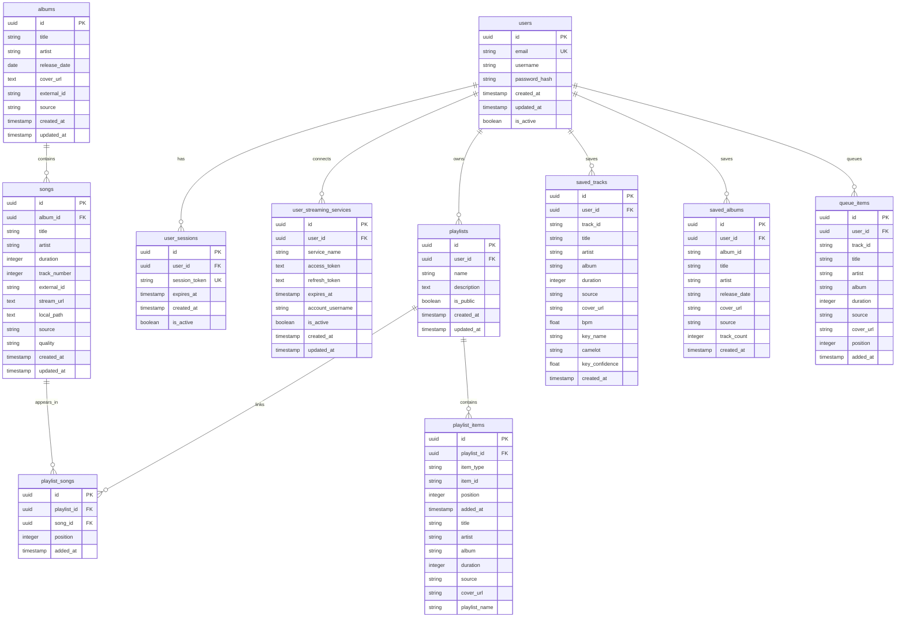

# Database Schema

This page documents the current PostgreSQL schema used by the backend.

The source of truth is the migration set in `apps/backend/src/migrator`, and the ER diagram below reflects the active tables and foreign-key relationships defined there.

## ER Diagram

## Notes

- `playlist_items` is the newer polymorphic playlist-content table. `item_type` distinguishes track entries from nested playlist entries, and `item_id` stores the referenced track or playlist identifier without a database-level foreign key.
- `playlist_songs` still exists for the older local-song playlist model, while provider-backed and nested playlist content is represented through `playlist_items`.
- `saved_tracks` stores additional analysis metadata such as BPM and harmonic key fields (`key_name`, `camelot`, and `key_confidence`).
